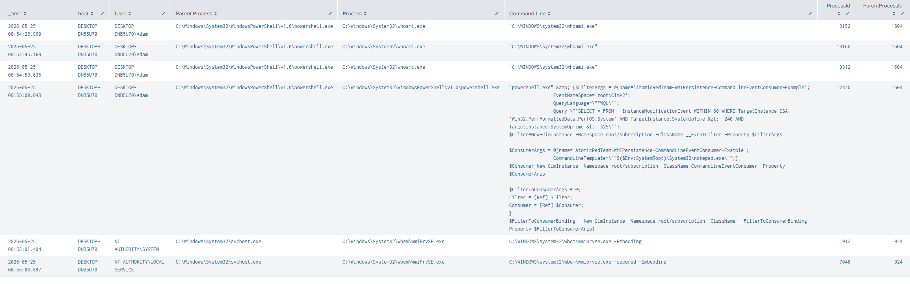
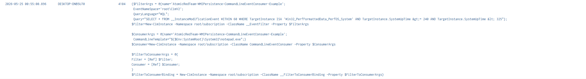
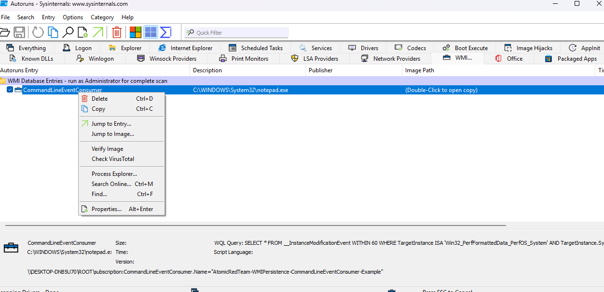

# H002 - WMI Event Subscription Persistence

## Hypothesis

An attacker may create a permanent WMI event subscription to maintain persistence on a Windows endpoint.

This technique can involve creating three WMI components:

- An event filter, which defines the trigger condition
- An event consumer, which defines the action to execute
- A filter-to-consumer binding, which links the trigger to the action


## MITRE ATT&CK Mapping

| Technique ID | Technique |
| T1546.003 | Event Triggered Execution: Windows Management Instrumentation Event Subscription |

This hunt maps to MITRE ATT&CK `T1546.003` because WMI event subscriptions can be used to execute commands automatically when a defined WMI event condition is met.

- https://attack.mitre.org/techniques/T1546/003/
  

## Background: Why WMI Matters to Defenders

We've all heard of registry run keys, scheduled tasks and the start up folder items. Threat actors still use all of these today and that's because they still work. WMI is simply another area to focus on for persistence. 

WMI is a built in Windows management technology used for system administration, monitoring, inventory, and remote management. Because it is native to Windows, it is commonly used by legitimate administrators and enterprise tools.

Attackers can abuse WMI for discovery, remote execution, lateral movement, and persistence. WMI event subscription persistence is particularly important because it allows a command or script to run automatically when a defined trigger condition is met.

This technique usually involves an event filter, an event consumer, and a filter-to-consumer binding. Defenders should look for these components being created close together and review what action the consumer is configured to execute.


## Test Method

## T1546.003-1: Persistence via WMI Event Subscription - CommandLineEventConsumer

This test uses Atomic Red Team technique **T1546.003** to simulate persistence through a **WMI Event Subscription** using a `CommandLineEventConsumer`. 

I Ran the test with the below (Required installing atomic red prereq):

```powershell
Invoke-AtomicTest T1546.003 -TestNumbers 1 -PathToAtomicsFolder C:\AtomicRedTeam\atomics
```


## Hunting for WMI Persistence with Sysmon

```spl
index=sysmon earliest=-30m (EventCode=19 OR EventCode=20 OR EventCode=21)
| eval wmi_event_type=case(
    EventCode=19, "WMI Event Filter Created",
    EventCode=20, "WMI Event Consumer Created",
    EventCode=21, "WMI Filter-to-Consumer Binding Created",
    true(), "Other WMI Event"
)
| table _time host User EventCode wmi_event_type RuleName Name Query Consumer CommandLineTemplate Destination
| rename wmi_event_type as "WMI Event Type", CommandLineTemplate as "Command Line Template"
| sort _time
```
-  Searching Sysmon endpoint telemetry.
- `(EventCode=19 OR EventCode=20 OR EventCode=21)` filters for WMI event subscription activity. 
- `case()` assigns a readable label to each WMI event type.
- `table` used to display the fields needed to understand the WMI persistence components.
- `sort _time` orders the events chronologically so the persistence chain can be reviewed in sequence.#
- Also used rename to help with readability 

**Results**


- This data provides key information about the WMI persistence mechanism, including the creation time, creator, event filter trigger logic, and the associated event consumer. The consumer is particularly important as it defines the action to execute, such as running a command or launching a payload when the filter condition is triggered.
- **Note**: The Sysmon `RuleName` field mapped the activity to `T1047 - Windows Management Instrumentation`. This reflects the use of WMI.
For this hunt, the behaviour is mapped to `T1546.003 - Event Triggered Execution: Windows Management Instrumentation Event Subscription` because the activity specifically involved creating a persistent WMI event subscription made up of a filter, consumer, and binding
 

**Event Filter AKA Trigger**
```
"SELECT * FROM __InstanceModificationEvent WITHIN 60 WHERE TargetInstance ISA 'Win32_PerfFormattedData_PerfOS_System' AND TargetInstance.SystemUpTime &gt;= 240 AND TargetInstance.SystemUpTime &lt; 325"
```
- This WMI query monitors system uptime and triggers when the machine has been running for between 240 and 325 seconds, which is roughly 4 to 5 minutes after startup. When this condition is met, the linked WMI Event Consumer is executed. 

**Event Consumer**

```
Destination "C:\\WINDOWS\\System32\\notepad.exe"
```
- In this scenario, notepad.exe is the payload configured within the WMI Event Consumer.
- notepad.exe is used here as a safe demonstration payload. In a real intrusion, the consumer could be configured to execute a malicious script, malware payload, reverse shell, or typically, utilizing LOLBINS when the WMI filter condition is triggered.
 
**WMI Filter-to-Consumer Binding Created**

- The Filter-to-Consumer Binding links the filter logic and the consumer action together.
- Without the binding, the filter may still detect that the condition is met, and the consumer may still contain the command to run, but nothing connects them together.


## Utilizing Event Code 1 Sysmon

- Using skills learnt from https://github.com/ADZYYYY/H001-Suspicious-PowerShell-Execution I would like to identify proccesses running around the timeframe of the WMI Event Subscription created
- We know the binding of the event occured at 2026-05-25 00:55:07.412, this can be observed in the sysmon WMI event results

 ```spl
index=sysmon EventCode=1 earliest="05/25/2026:00:53:00" latest="05/25/2026:00:57:00"
| table _time host User ParentImage Image CommandLine ProcessId ParentProcessId
| rename ParentImage as "Parent Process", Image as "Process", CommandLine as "Command Line"
| sort _time 
 ```

**Results**



- The process creation results showed PowerShell activity around the same time as the WMI event subscription creation.

- The key event was a `powershell.exe` process launching another `powershell.exe` process with a command line containing:

```text
New-CimInstance -Namespace root/subscription -ClassName __EventFilter
New-CimInstance -Namespace root/subscription -ClassName CommandLineEventConsumer
New-CimInstance -Namespace root/subscription -ClassName __FilterToConsumerBinding
```

- This showed that PowerShell was used to create the WMI event filter, command-line event consumer, and filter-to-consumer binding.

- Additional `WmiPrvSE.exe` activity was observed shortly after the PowerShell command. `WmiPrvSE.exe` is the WMI Provider Host process, so this supported the conclusion that WMI activity occurred on the endpoint.


## Additional Checks for Powershell 4104 Events 

- After process creation telemetry showed PowerShell creating the WMI subscription components, I reviewed PowerShell Event ID `4104` to validate the script block content.

   ```spl
   index=powershell earliest=-60m
    | rex "<EventID>(?<EventCode>\d+)</EventID>"
    | rex "<Data Name='ScriptBlockText'>(?<ScriptBlockText>.*?)</Data>"
    | search EventCode=4104
    | search ScriptBlockText="*__EventFilter*" OR ScriptBlockText="*CommandLineEventConsumer*" OR ScriptBlockText="*__FilterToConsumerBinding*" OR ScriptBlockText="*root\\subscription*" OR ScriptBlockText="*Set-WmiInstance*" OR ScriptBlockText="*New-CimInstance*" OR ScriptBlockText="*Atomic*"
    | table _time host EventCode ScriptBlockText
    | sort - _time
     ```

**Results**



   - The most useful PowerShell 4104 event was the script block at `00:55:00.896`, which showed `New-CimInstance` being used to create the `__EventFilter`, `CommandLineEventConsumer`, and `__FilterToConsumerBinding`. This validated the script content responsible for creating the WMI event subscription observed in Sysmon Event IDs 19, 20, and 21.
   - Surrounding Events not worth showing


## Timeline of Activity

| Time | Data Source | Event / Activity | Analyst Notes |
|---|---|---|---|
| 00:54:26 | PowerShell 4104 | `Invoke-AtomicTest T1546.003 -ShowDetailsBrief` executed | Atomic Red Team test details were reviewed. |
| 00:54:45 | PowerShell 4104 | `Invoke-AtomicTest T1546.003 -TestNumbers 1 -CheckPrereqs` executed | Atomic Red Team prerequisite check was run. |
| 00:54:59 | PowerShell 4104 | `Invoke-AtomicTest T1546.003 -TestNumbers 1` executed | Atomic Red Team WMI persistence test was started. |
| 00:55:00 | Sysmon Event ID 1 | `powershell.exe` launched another `powershell.exe` process containing `New-CimInstance` commands | Process creation showed PowerShell creating WMI subscription components. |
| 00:55:00 | PowerShell 4104 | Script block contained `New-CimInstance`, `__EventFilter`, `CommandLineEventConsumer`, and `__FilterToConsumerBinding` | PowerShell script block logging confirmed the script content used to create the WMI subscription. |
| 00:55:01 | Sysmon Event ID 19 | WMI Event Filter created | Trigger condition was created. |
| 00:55:01 | Sysmon Event ID 20 | WMI Event Consumer created | Action was created. In this test, the consumer was configured to run `notepad.exe`. |
| 00:55:01 | Sysmon Event ID 1 | `WmiPrvSE.exe` started under `svchost.exe` | WMI Provider Host activity was observed shortly after the WMI creation command. |
| 00:55:07 | Sysmon Event ID 21 | WMI Filter-to-Consumer Binding created | The trigger and action were linked, completing the WMI event subscription chain. |


## General Triage Steps

If this detection fired in a real environment, the analyst should validate whether the WMI event subscription is authorised or suspicious.

### 1. Confirm the WMI Persistence Chain

Review Sysmon Event IDs `19`, `20`, and `21` on the same host within a short time window.

- Event ID `19` = WMI event filter created
- Event ID `20` = WMI event consumer created
- Event ID `21` = WMI filter-to-consumer binding created

The presence of all three events close together suggests a complete WMI event subscription was created.

### 2. Review the Consumer Action

Check what the WMI consumer is configured to execute.

Focus on fields such as:

- `CommandLineTemplate`
- `Consumer`
- `Destination`

Higher-risk examples include consumers executing:

- `powershell.exe`
- `cmd.exe`
- `wscript.exe`
- `cscript.exe`
- `mshta.exe`
- `rundll32.exe`
- Files from user-writable paths such as `C:\Users`, `C:\ProgramData`, `AppData`, or `C:\Temp`

### 3. Identify the Creating Process

Pivot to Sysmon Event ID `1` around the same timestamp to identify what process created the WMI subscription.

Useful fields:

- `ParentImage`
- `Image`
- `CommandLine`
- `User`
- `ProcessId`
- `ParentProcessId`

This helps determine whether the activity came from PowerShell, an admin tool, an EDR/management agent, or an unknown process.

### 4. Review PowerShell Script Block Logs

If PowerShell was involved, review PowerShell Event ID `4104` around the same time.

Look for script content containing:

- `New-CimInstance`
- `Set-WmiInstance`
- `__EventFilter`
- `CommandLineEventConsumer`
- `__FilterToConsumerBinding`
- `root\subscription`

This can confirm the script content used to create the WMI subscription.

### 5. Validate Legitimacy

Determine whether the WMI subscription is expected.

Check:

- Is the host managed by SCCM, Intune, monitoring agents, or other management tooling?
- Is the user expected to create WMI subscriptions?
- Does the consumer execute a known and approved command?
- Is the subscription name related to known software or suspicious naming?
- Does the timing align with approved change activity?

### 6. Scope for Related Activity

Search for the same WMI subscription name, command, or user across other hosts.

Also review related activity around the same time:

- PowerShell execution
- File creation
- Network connections
- Registry changes
- New services
- Scheduled tasks
- Suspicious logons

### 7. Contain and Remove if Unauthorised

If the WMI subscription is confirmed as unauthorised or malicious:

- Isolate the host if needed
- Preserve evidence
- Remove the WMI binding first
- Remove the event consumer
- Remove the event filter
- Re-scan the host
- Continue investigation for initial access and additional persistence

   

## Findings 

PowerShell Event ID 4104 did not provide significantly more context than Sysmon Event ID 1 in this test, because the full WMI creation command was already visible in the Sysmon process command line. Another win for sysmon :D

However, 4104 was still useful as supporting evidence because it confirmed the script block content processed by PowerShell, including the use of `New-CimInstance` to create the `__EventFilter`, `CommandLineEventConsumer`, and `__FilterToConsumerBinding`.

For this hunt, Sysmon Event IDs `19`, `20`, and `21` were the primary evidence of WMI persistence object creation, Sysmon Event ID `1` showed the process responsible, and PowerShell Event ID `4104` validated the script content.

- This analysis answered the key questions we'd need to understand during investigation


| Question | Answer |
|---|---|
| When was it created? | The WMI subscription components were created around `00:55:01` on `DESKTOP-DNB5U70`. |
| What created it? | PowerShell created the WMI objects using `New-CimInstance`. |
| Which user created it? | The activity was associated with `DESKTOP-DNB5U70\Adam` (Ran by myself under user context). |
| What was created? | A WMI event filter, command-line event consumer, and filter-to-consumer binding. |
| What was the trigger? | The event filter used a WQL query based on system uptime: `Win32_PerfFormattedData_PerfOS_System` with `SystemUpTime >= 240` and `< 325`. |
| What action would run? | The `CommandLineEventConsumer` was configured to execute `C:\WINDOWS\System32\notepad.exe`. |
| How was the trigger linked to the action? | Sysmon Event ID `21` showed the filter-to-consumer binding linking the event filter to the command-line consumer. |
| Why is it suspicious? | The filter, consumer, and binding were created close together, forming a complete WMI event subscription persistence chain. |
| What validated the script content? | PowerShell Event ID `4104` showed `New-CimInstance` being used to create `__EventFilter`, `CommandLineEventConsumer`, and `__FilterToConsumerBinding`. |


## Removal of WMI Persistence

- There are many ways to remove the WMI entries, if you have physical access to the machine or remote access you can simply download Autoruns from sysinternals - https://learn.microsoft.com/en-us/sysinternals/downloads/autoruns , select the WMI tab, and remove the malicous entries
 


- From an RTR perspective, for e.g using crowdstrike you can utilize the following commands in the runscript function. These can also just be ran in powershell on the host.

**Example review commands through RTR/PowerShell:**
```
Get-WmiObject -Namespace root\Subscription -Class __EventFilter -Filter "Name='AtomicRedTeam-WMIPersistence-CommandLineEventConsumer-Example'"

Get-WmiObject -Namespace root\Subscription -Class CommandLineEventConsumer -Filter "Name='AtomicRedTeam-WMIPersistence-CommandLineEventConsumer-Example'"

Get-WmiObject -Namespace root\Subscription -Class __FilterToConsumerBinding -Filter "__Path LIKE '%AtomicRedTeam-WMIPersistence-CommandLineEventConsumer-Example%'"
```

**Example removal commands:**
```
Get-WmiObject -Namespace root\Subscription -Class __FilterToConsumerBinding -Filter "__Path LIKE '%AtomicRedTeam-WMIPersistence-CommandLineEventConsumer-Example%'" |
Remove-WmiObject -Verbose

Get-WmiObject -Namespace root\Subscription -Class CommandLineEventConsumer -Filter "Name='AtomicRedTeam-WMIPersistence-CommandLineEventConsumer-Example'" |
Remove-WmiObject -Verbose

Get-WmiObject -Namespace root\Subscription -Class __EventFilter -Filter "Name='AtomicRedTeam-WMIPersistence-CommandLineEventConsumer-Example'" |
Remove-WmiObject -Verbose 
```

- After removal, you can rerun Get-WmiObject to review the deletion was sucessfull

## Building Real detections around this

Alert when WMI Event Filter, Consumer, and Binding are created on the same host within a short time window.
Increase severity if the consumer is designed to execute powershell.exe, cmd.exe, wscript.exe, mshta.exe, rundll32.exe, or a user writable path.
Suppress known enterprise management tools.

- e.g of what this could look like
- This could be paired with a lookup table which will filter out known WMI tools, causing less noise

```spl
index=sysmon (EventCode=19 OR EventCode=20 OR EventCode=21)
| eval wmi_event_type=case(
    EventCode=19, "filter",
    EventCode=20, "consumer",
    EventCode=21, "binding"
)
| eval consumer_command=coalesce(CommandLineTemplate, Destination, Consumer)
| eval consumer_command_lower=lower(consumer_command)
| eval suspicious_consumer=case(
    like(consumer_command_lower,"%powershell.exe%"), "PowerShell consumer",
    like(consumer_command_lower,"%cmd.exe%"), "CMD consumer",
    like(consumer_command_lower,"%wscript.exe%"), "Windows Script Host consumer",
    like(consumer_command_lower,"%cscript.exe%"), "Windows Script Host consumer",
    like(consumer_command_lower,"%mshta.exe%"), "MSHTA consumer",
    like(consumer_command_lower,"%rundll32.exe%"), "Rundll32 consumer",
    like(consumer_command_lower,"%regsvr32.exe%"), "Regsvr32 consumer",
    like(consumer_command_lower,"%\\users\\%"), "User-writable path",
    like(consumer_command_lower,"%\\programdata\\%"), "User-writable path",
    like(consumer_command_lower,"%\\appdata\\%"), "User-writable path",
    like(consumer_command_lower,"%\\temp\\%"), "User-writable path",
    true(), "None"
)
| bin _time span=5m
| stats 
    earliest(_time) as first_seen
    latest(_time) as last_seen
    values(EventCode) as event_codes
    dc(EventCode) as unique_event_codes
    values(wmi_event_type) as wmi_event_types
    values(Name) as names
    values(Query) as queries
    values(Consumer) as consumers
    values(CommandLineTemplate) as command_line_templates
    values(Destination) as destinations
    values(suspicious_consumer) as suspicious_indicators
    values(User) as users
    count as event_count
    by _time host
| eval has_filter=if(mvfind(event_codes,"19")>=0,1,0)
| eval has_consumer=if(mvfind(event_codes,"20")>=0,1,0)
| eval has_binding=if(mvfind(event_codes,"21")>=0,1,0)
| where has_filter=1 AND has_consumer=1 AND has_binding=1
| eval severity=case(
    mvfind(suspicious_indicators,"PowerShell consumer")>=0, "High",
    mvfind(suspicious_indicators,"CMD consumer")>=0, "High",
    mvfind(suspicious_indicators,"Windows Script Host consumer")>=0, "High",
    mvfind(suspicious_indicators,"MSHTA consumer")>=0, "High",
    mvfind(suspicious_indicators,"Rundll32 consumer")>=0, "High",
    mvfind(suspicious_indicators,"Regsvr32 consumer")>=0, "High",
    mvfind(suspicious_indicators,"User-writable path")>=0, "Medium",
    true(), "Medium"
)
| table first_seen last_seen host users event_codes wmi_event_types names queries command_line_templates consumers destinations suspicious_indicators severity event_count
| sort - first_seen
```

This query looks for the full WMI event subscription chain by correlating Sysmon Event IDs `19`, `20`, and `21` on the same host within a 5-minute window. It labels each event as a filter, consumer, or binding, then checks whether all three components were created close together. The query also reviews the consumer action to identify higher risk behaviour, such as WMI executing `powershell.exe`, `cmd.exe`, script hosts, LOLBins, or files from user writable paths for e.g in the home folder, not system32 :D. This makes the logic more useful than alerting on a single WMI event, as it looks for the complete persistence chain and adds basic severity context.

**Key parts Broken down:**

- `EventCode=19 OR EventCode=20 OR EventCode=21` searches for WMI filter, consumer, and binding creation events.
- `case()` labels each event as `filter`, `consumer`, or `binding`.
- `coalesce(CommandLineTemplate, Destination, Consumer)` creates one field to review the WMI consumer/action, even if different events populate different fields.
- `suspicious_consumer` checks whether the consumer runs risky binaries like `powershell.exe`, `cmd.exe`, `mshta.exe`, `rundll32.exe`, or references user-writable paths.
- `bin _time span=5m` groups nearby events into 5-minute windows so related WMI events can be correlated.
- `stats ... by _time host` groups the WMI activity by host and time window.
- `has_filter`, `has_consumer`, and `has_binding` check whether the full WMI subscription chain exists.
- `severity` increases priority when the consumer action looks more suspicious.


